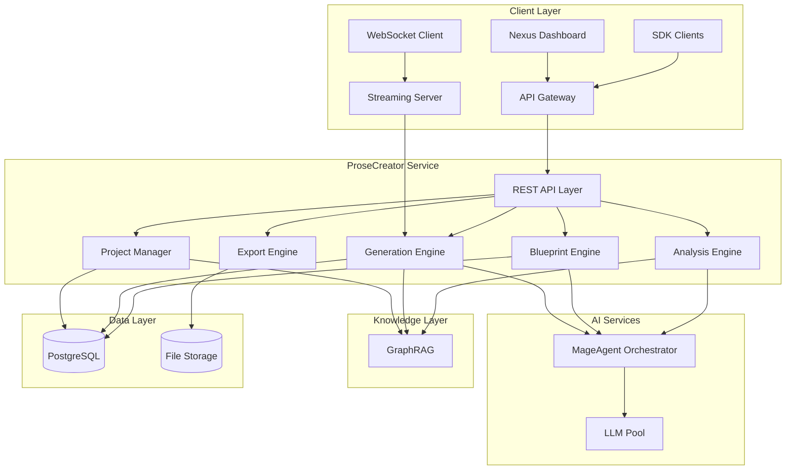
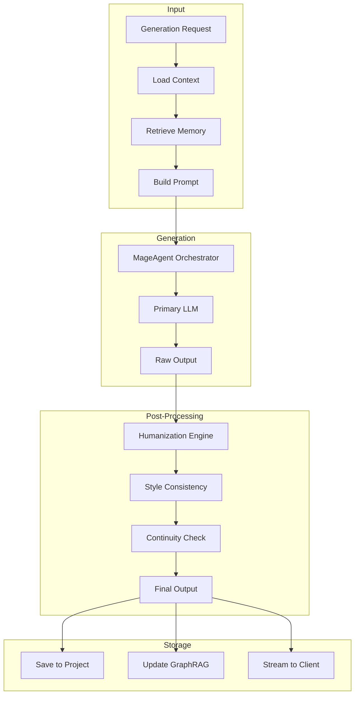
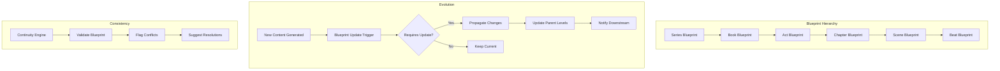
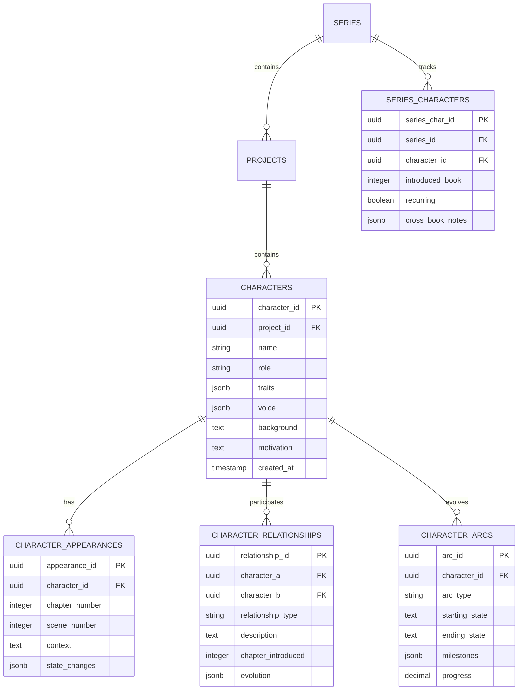
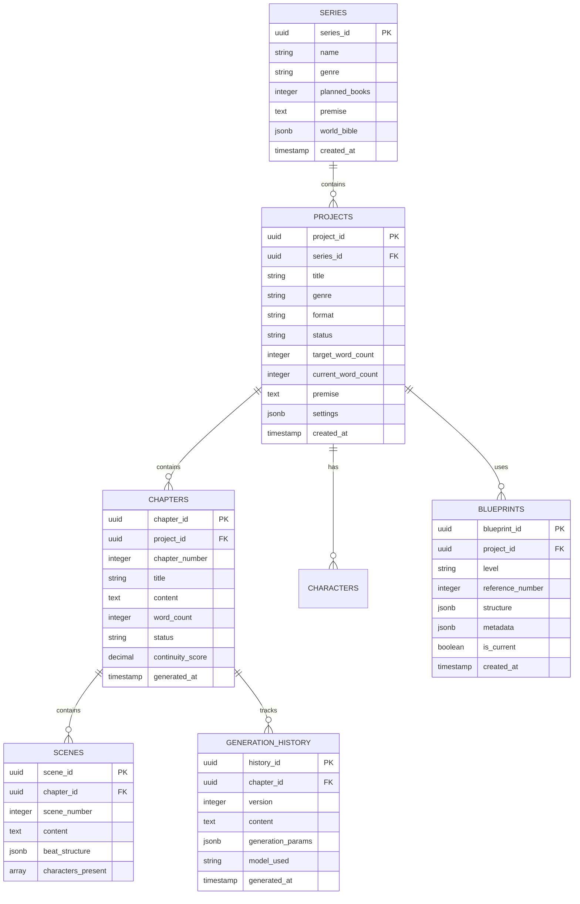
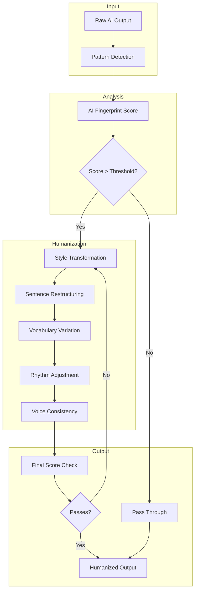
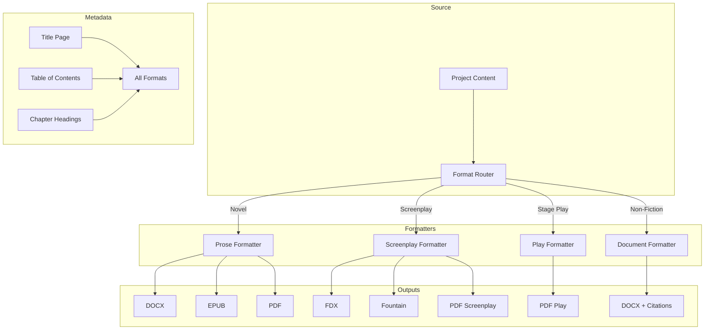

# ProseCreator Architecture

Technical architecture and system design for AI-powered creative writing.

---

## System Overview



---

## Core Components

### 1. REST API Layer

| Endpoint | Method | Description |
|----------|--------|-------------|
| `/prosecreator/api/projects` | POST | Create new writing project |
| `/prosecreator/api/projects/:id` | GET | Get project details |
| `/prosecreator/api/blueprints/series` | POST | Generate series blueprint |
| `/prosecreator/api/blueprints/project` | POST | Generate project blueprint |
| `/prosecreator/api/blueprints/chapter` | POST | Generate chapter blueprint |
| `/prosecreator/api/generation/beat` | POST | Generate single beat |
| `/prosecreator/api/generation/chapter` | POST | Generate full chapter |
| `/prosecreator/api/characters` | POST | Create character |
| `/prosecreator/api/characters/:project_id` | GET | List project characters |
| `/prosecreator/api/research` | POST | Generate research brief |
| `/prosecreator/api/analysis/continuity` | POST | Run continuity check |
| `/prosecreator/api/analysis/plot-holes` | POST | Detect plot holes |

### 2. Project Manager

Handles project lifecycle and metadata.

**Capabilities:**
- Project creation and configuration
- Series management and linking
- Word count tracking
- Export history

### 3. Blueprint Engine

Generates story structures at multiple levels.

**Blueprint Types:**
- Series blueprints (multi-book arcs)
- Project blueprints (single book structure)
- Chapter blueprints (scene-level detail)
- Beat blueprints (moment-by-moment)

### 4. Generation Engine

AI-powered content generation with humanization.

**Features:**
- Multi-model generation pipeline
- Real-time streaming via WebSocket
- Humanization post-processing
- Style consistency enforcement

### 5. Analysis Engine

Continuous quality and consistency checks.

**Capabilities:**
- Continuity verification
- Plot hole detection
- Pacing analysis
- Character consistency
- Dialogue voice matching

### 6. Export Engine

Multi-format manuscript export.

**Formats:**
- DOCX (Microsoft Word)
- EPUB (eBooks)
- PDF (Print-ready)
- FDX (Final Draft for screenplays)
- Fountain (Plain text screenplay)
- Markdown

---

## Generation Pipeline



---

## Living Blueprint Architecture



---

## Infinite Memory System

```mermaid
flowchart TB
    subgraph Memory Layers
        A[Short-term: Current Chapter] --> B[Medium-term: Current Book]
        B --> C[Long-term: Series Bible]
        C --> D[Permanent: World Rules]
    end

    subgraph GraphRAG Integration
        E[New Content] --> F[Entity Extraction]
        F --> G[Relationship Mapping]
        G --> H[Knowledge Graph Update]
        H --> I[Embedding Generation]
    end

    subgraph Retrieval
        J[Generation Context] --> K[Query Knowledge Graph]
        K --> L[Semantic Search]
        L --> M[Relevance Ranking]
        M --> N[Context Assembly]
    end
```



---

## Character Management System



---

## Data Model



---

## Humanization Engine



---

## Multi-Format Export



---

## Security Model

### Authentication
- Bearer token via Nexus API Gateway
- WebSocket token authentication for streaming
- Rate limiting per tier

### Authorization
- Project-level access control
- Series-level permissions
- Export access management

### Data Protection
- Content encrypted at rest
- Secure streaming connections (WSS)
- No training on user content

---

## Deployment Architecture

### Kubernetes Configuration

```yaml
apiVersion: apps/v1
kind: Deployment
metadata:
  name: nexus-prosecreator
  namespace: nexus-plugins
spec:
  replicas: 5
  selector:
    matchLabels:
      app: nexus-prosecreator
  template:
    spec:
      containers:
      - name: prosecreator-api
        image: adverant/nexus-prosecreator:1.0.0
        ports:
        - containerPort: 8080
        - containerPort: 8081  # WebSocket
        resources:
          requests:
            memory: "2Gi"
            cpu: "1000m"
          limits:
            memory: "4Gi"
            cpu: "2000m"
        livenessProbe:
          httpGet:
            path: /prosecreator/api/health/live
            port: 8080
        readinessProbe:
          httpGet:
            path: /prosecreator/api/health/ready
            port: 8080
```

### Resource Allocation

| Component | CPU | Memory | Storage |
|-----------|-----|--------|---------|
| API Server | 1000m-2000m | 2Gi-4Gi | - |
| Generation Worker | 2000m-4000m | 4Gi-8Gi | 20Gi |
| Streaming Server | 500m-1000m | 1Gi-2Gi | - |
| Export Worker | 500m-1000m | 1Gi-2Gi | 50Gi |

---

## Performance

### Generation Capacity

| Tier | Words/Hour | Concurrent Jobs | Stream Quality |
|------|------------|-----------------|----------------|
| Free | 2,500 | 1 | - |
| Author | 10,000 | 3 | Standard |
| Professional | 25,000 | 10 | High |
| Studio | 50,000+ | 20 | Premium |

### Latency Targets

| Operation | Target |
|-----------|--------|
| Project Creation | < 2s |
| Blueprint Generation | < 30s |
| Chapter Generation (avg) | 60-120s |
| Beat Generation | < 10s |
| Continuity Check | < 15s |
| Export (per format) | < 30s |

---

## Monitoring

### Metrics (Prometheus)

```
# Generation metrics
prosecreator_words_generated_total
prosecreator_chapters_generated_total
prosecreator_generation_duration_seconds

# Quality metrics
prosecreator_humanization_score
prosecreator_continuity_score
prosecreator_regeneration_rate

# Streaming metrics
prosecreator_active_streams
prosecreator_stream_latency_ms
```

### Alerting

| Alert | Condition | Severity |
|-------|-----------|----------|
| Generation Failure | >5% failure rate | Critical |
| Humanization Below Threshold | Score < 0.85 | Warning |
| Stream Latency High | > 500ms | Warning |
| Queue Backup | > 100 pending | Warning |

---

## Next Steps

- [Quick Start Guide](./QUICKSTART.md) - Get started quickly
- [Use Cases](./USE-CASES.md) - Creative writing workflows
- [API Reference](./docs/api-reference/endpoints.md) - Complete docs

